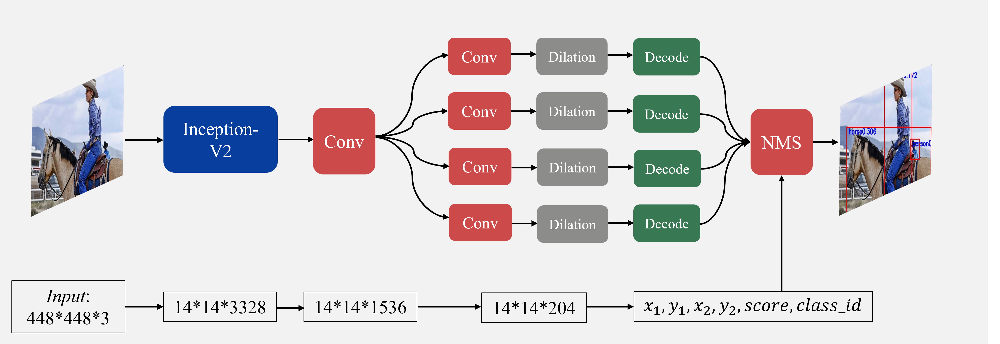
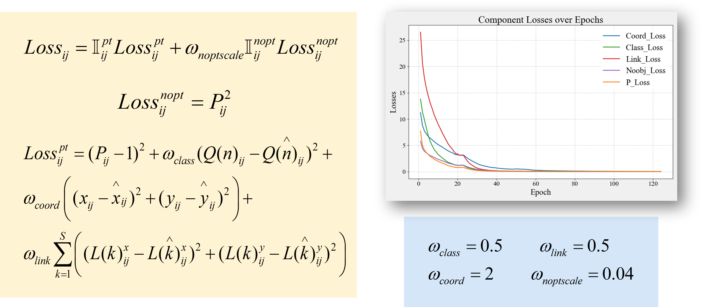
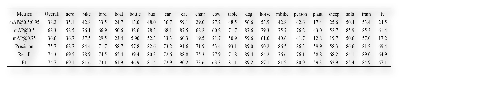

# Point Linking Network for Object Detection 复现代码
## [论文链接](https://arxiv.org/abs/1706.03646) & [reference code](https://github.com/Shallow-W/PointLN)
- 有疑问欢迎联系 703904898@qq.com
- if any question, welcome to cantact 703904898@qq.com
## 一些说明和注释
### 关于环境
- 用autodl的话，直接部署yolov8的环境torch版本就没问题
- 在自己GPU上练，我的pytorch版本： `torch,torchaudio = 2.3.0 + cu118`
### 关于数据
- 用的 PASCAL VOC 2007
  - The training data includes VOC 2007 trainval and VOC 2012 trainval, which has 16551 images in total. The testing data is VOC 2007, which has 4952 images.
- 为什么会有 `voc_test_448.txt & voc_original_trainval.txt`?
  - 代码里`PLNdata.py`读取原始标注（图片大小不一致，不一定是`448*448`）
  - 正向传播之后图片都被`resize`到`448*448`，输出检测框也在此尺度
  - 因此验证代码需要读取`448*448`尺度下的gt，才能正常计算metric
### PLNnet.py
- 以 InceptionV2 为 Backbone，详细框架与论文完全一致,如下图。
 
- 需要下载预训练模型权重，并替换地址以加载预训练模型。 
### PLNLoss.py
- 构建损失函数，如下图所示.代码支持返回训练组合损失。

### PLNdata.py
- 根据标注生成训练所需数据，原理自己看论文。
### draw_gts.py
- 在数据集的图片上绘制gt框。注意改路径。
- 注意，先跑检测再绘制，原因见 **“关于数据”**
### train.py
- 所有参数在接口里面调应该就可以
- `'eval_interval': 1000`是因为验证实在是太慢了 就只训练了
- `eval_config` 是验证阈值配置，主要服务于NMS筛选。
- `'aspect_ratio_threshold': 3.5` 证明是有用的 别的用处不大
### val.py
- 设定阈值，计算指标，输出指标和PR_Curve
### predict.py
- 设定阈值，输出检测图片
### 补充说明
- 代码是没问题的，报错先检查路径问题和环境问题
- 尤其是train val predict 里面接口有点乱
## demos
- 定性分析 见下图

- 定量指标 见下表

## conclusion
- 这里指标还是不够高，可能的改进方向（个人认为由高到低）
  - 数据增强
  - 前面的Loss权重参数的选取
  - 加epoch 我只练了125epoch
- 针对验证速度慢的问题，改进方向：
  - 验证代码那里 for 循环然后 NMS 检索太慢了 要并行化处理
  - 这点改进空间巨大

# IF useful， give a STAR！
